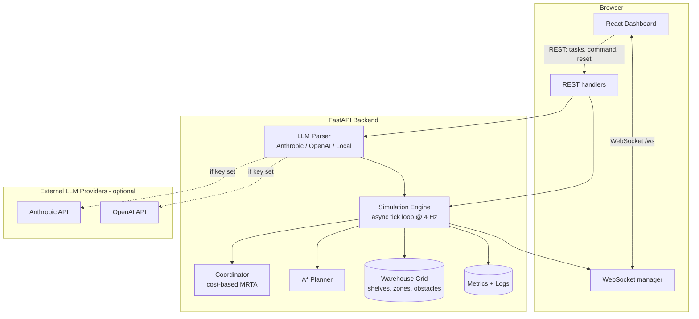
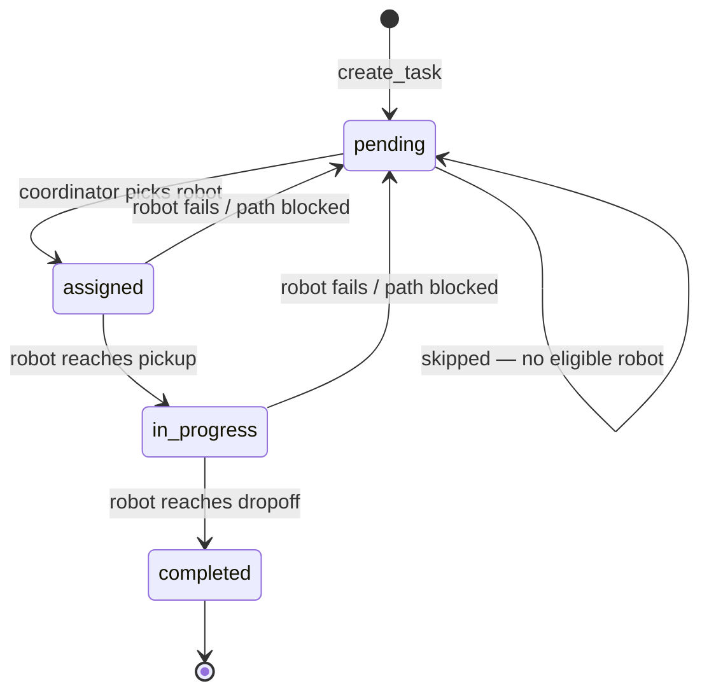
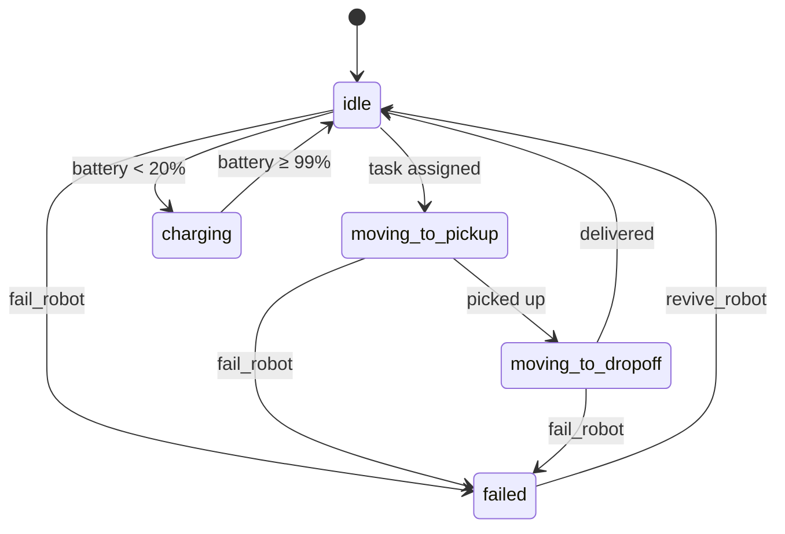
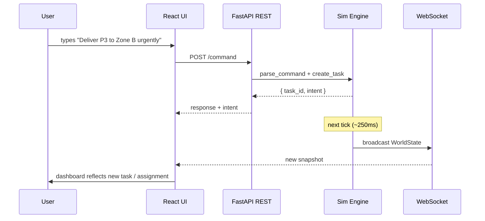

# System Architecture

This document describes the architecture of **Warehouse AI** — the module
layout on the backend, the component tree on the frontend, the data
contracts between them, and the WebSocket message format.

---

## 1. High-level diagram



---

## 2. Backend architecture

The backend is a single FastAPI process owning a single asyncio event
loop. There is exactly one writer of simulation state — the tick coroutine
— with all external mutators serialized through an `asyncio.Lock`. This
keeps the code free of subtle concurrency bugs.

### Module responsibilities

| Module                  | Role                                                                 |
|-------------------------|----------------------------------------------------------------------|
| `main.py`               | FastAPI app, lifespan hooks, REST + WebSocket routes                 |
| `models.py`             | All Pydantic data contracts (robots, tasks, intents, snapshots)      |
| `warehouse.py`          | Static map: grid, shelves, zones, charging stations, obstacles       |
| `pathfinding.py`        | A* planner with dynamic blockers and a max-expansions safety cap     |
| `coordinator.py`        | Task allocation — scores robots, picks the lowest cost               |
| `simulation.py`         | The tick loop, fleet state, battery, failures, public mutator API    |
| `llm_parser.py`         | Three-backend parser: Anthropic / OpenAI / local rules               |
| `metrics.py`            | Counters and derived stats                                           |
| `websocket_manager.py`  | Connection set + fire-and-forget broadcast with dead-client pruning  |

### Tick loop

```text
   ┌───────────── 1 / TICK_HZ seconds ─────────────┐
   ▼                                                ▼
 ┌─────────────────────────────────────────────────┐
 │ async with self._lock:                          │
 │   1. assign_pending_tasks()                     │  ← coordinator
 │   2. step_robots()                              │  ← one cell each
 │   3. maybe_send_low_battery_to_charge()         │
 │   4. snapshot = build_world_state()             │
 │ await ws.broadcast(snapshot)                    │
 └─────────────────────────────────────────────────┘
```

### Task lifecycle



### Robot lifecycle



---

## 3. Frontend architecture

The dashboard is a single-page React app. There's no Redux / Zustand —
the entire world state is one immutable snapshot held in `App.tsx` and
replaced on every WebSocket message. All components derive their props
from that snapshot. The simplicity of "no client-side state" is a
feature: the dashboard cannot drift from the truth.

### Component tree

```text
App
├── MetricsPanel
│   └── ConnectionBadge
├── Fleet (sidebar)
│   └── RobotCard ×N
├── WarehouseMap          ← SVG floor + animated robots
├── LogsPanel
├── CommandConsole
└── TaskPanel
```

### Layout (CSS Grid)

```text
┌──────────────────────────────────────────────────────────────────┐
│  Header (logo · title · [+ Obstacle] [Reset World])              │
├──────────────────────────────────────────────────────────────────┤
│ ┌─ aside ──────┬─── section (col-span 6) ────┬─ aside ─────────┐ │
│ │ Metrics      │  ┌─ Warehouse Map ────────┐ │ Command Console│ │
│ │ ─────────    │  │                        │ │                │ │
│ │ Fleet        │  │   (SVG)                │ │ ───────────────│ │
│ │ ┌─ Robot 1 ──┤  │                        │ │ Task Panel     │ │
│ │ │ battery    │  └────────────────────────┘ │                │ │
│ │ ├─ Robot 2 ──┤  ┌─ Logs ─────────────────┐ │                │ │
│ │ │ ...        │  │ 17:42:11 · [coord] ... │ │                │ │
│ └──────────────┴────────────────────────────┴─────────────────┘  │
└──────────────────────────────────────────────────────────────────┘
```

### State flow



---

## 4. Data flow

### REST + WebSocket split

REST is used for **commands** (state-changing requests with discrete
responses). WebSocket is used for **state** (continuous broadcast of the
world snapshot). This split keeps the contracts cleanly separated:
mutators are explicit and traceable; reads are reactive.

| Direction        | Channel    | Examples                                       |
|------------------|------------|------------------------------------------------|
| Client → Server  | REST POST  | `/tasks`, `/command`, `/simulate/failure/{id}` |
| Client → Server  | REST GET   | `/state`, `/health`                            |
| Server → Client  | WebSocket  | `{type: "state", data: WorldState}` per tick   |

### WebSocket message format

Every message is a JSON object with a `type` and a `data` payload:

```json
{
  "type": "state",
  "data": {
    "grid_width": 30,
    "grid_height": 18,
    "grid": [["free","free", ...], ...],
    "robots": [
      {
        "id": "robot_0",
        "name": "Atlas",
        "x": 12,
        "y": 9,
        "status": "moving_to_pickup",
        "battery": 0.74,
        "current_task_id": "TBF715",
        "path": [[13,9],[14,9],[15,9]],
        "carrying_package": null,
        "failed": false,
        "distance_travelled": 18,
        "tasks_completed": 2,
        "replans": 1
      }
    ],
    "tasks":   [...],
    "zones":   [...],
    "obstacles": [[16, 14]],
    "metrics": {
      "tasks_completed": 7,
      "tasks_failed": 0,
      "tasks_reassigned": 1,
      "active_robots": 3,
      "failed_robots": 0,
      "replanning_events": 4,
      "average_completion_time_s": 12.3,
      "total_distance": 142,
      "uptime_s": 124.5
    },
    "logs":  [...],
    "tick":  498,
    "timestamp": 1716221451.32
  }
}
```

The payload is intentionally a **full snapshot** rather than a delta. At
4 Hz and ~5 KB per snapshot this is well under any realistic bandwidth
budget, and it eliminates an entire class of "diff got lost, client now
shows stale data" bugs.

---

## 5. Error handling

| Failure                                  | Handled by                                              |
|------------------------------------------|---------------------------------------------------------|
| Tick coroutine raises                    | Logged, tick continues — never crashes the engine       |
| WebSocket client disconnects mid-send    | Pruned silently by `ConnectionManager`                  |
| LLM API call fails / times out           | Caught, falls back to deterministic rule-based parser   |
| A* finds no path                         | Returns `None`, coordinator postpones the task          |
| Battery hits zero mid-task               | Task → `pending`, robot → `idle`, logged as error       |
| Robot exceeds `REPLAN_RETRY_LIMIT`       | Task → `pending`, marked previously-failed for that bot |

---

## 6. Why these choices

- **Single tick coroutine + asyncio lock** — simpler than threads or
  multi-process actors; perfectly adequate at a 4 Hz tick rate.
- **Full-snapshot broadcasts** — trivial to debug; no diff-merge logic on
  the client; cheap at this scale.
- **Cost-based greedy MRTA** — easier to explain to humans than auctions
  or ILP solvers, and competitive for warehouses < ~20 robots.
- **Three-backend parser with local fallback** — guarantees the demo
  always works offline; no hard dependency on any API key.
- **4-connected grid + Manhattan heuristic** — keeps paths visually clean
  (no corner-cutting) and the heuristic admissible.
